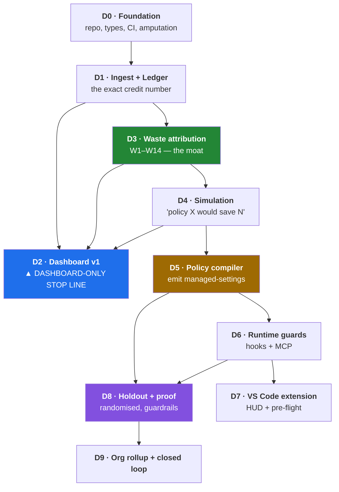

# TokenLens — Phase-Wise Development Plan

**Engineering execution plan.** Companion to `DriftLens-main/docs/PLAN.md` (strategy) and `docs/AUDIT.md` (why the rebuild).

| | |
|---|---|
| **Document type** | Build plan — modules, contracts, commands, tests, exit criteria |
| **Date** | 2026-07-30 |
| **Status** | Awaiting go-ahead. No code written yet |
| **Source of truth for *why*** | `PLAN.md` Parts I–IV |
| **Source of truth for *what to build*** | This document |

---

## 0. The two questions, answered first

### 0.1 What exactly is this tool?

**One Node.js/TypeScript binary that runs in five modes, plus one optional VS Code extension.**

It is **not** "only a CLI" — but the CLI is the trunk and everything else is a branch off the same compiled artefact. There is exactly one codebase, one build, one version number.

| # | Mode | Invoked by | What it is | Phase |
|---|---|---|---|---|
| **1** | **CLI** | Human, in a terminal | `tokenlens ledger`, `waste`, `simulate`, `policy`, `verify` | D1 |
| **2** | **Local web dashboard** | `tokenlens dashboard` → opens `localhost:7331` | Fastify server + static SPA. **Started by the CLI**, not a deployed service | D2 |
| **3** | **Hook binary** | **VS Code Copilot agent**, automatically, per tool call | `tokenlens hook --event PreToolUse` reads JSON on stdin, writes JSON on stdout. Same binary, different subcommand | D6 |
| **4** | **MCP server** | VS Code, over stdio | `tokenlens mcp` exposes budget state as MCP tools | D6 |
| **5** | **Policy compiler** | CI / platform engineer | `tokenlens policy --emit` produces `managed-settings.json`, `.reg` payloads, `.agent.md` files as **artefacts on disk** | D5 |
| **6** | **VS Code extension** *(separate package, optional)* | Developer installs it | Status-bar HUD, pre-flight cost estimate. Thin UI shell — calls the core binary | D7 |

**Critical architectural point:** modes 3, 4 and 5 are *not* separate products. They are `commander` subcommands on the same `tokenlens` binary. A hook invocation is `tokenlens hook`, a policy emit is `tokenlens policy`. This keeps one ingest layer, one ledger, one rate card, and one version to reason about.

**What it is NOT:**

- ❌ Not a SaaS. No vendor endpoint. No account.
- ❌ Not a proxy. Copilot traffic is never intercepted or routed.
- ❌ Not a daemon. Nothing runs in the background unless the user starts `dashboard` or `watch`.
- ❌ Not an agent. It never writes to a developer's source code. Policy output is a **draft PR**, never a silent write.

**Distribution:**

| Artefact | Registry | Consumer |
|---|---|---|
| `tokenlens` npm package | npm (or internal Artifactory/Azure Artifacts) | Developers, CI |
| `tokenlens-vscode` `.vsix` | Internal extension gallery | Developers (optional) |
| Generated policy files | Org config repo, via draft PR | Platform/MDM team |

---

### 0.2 Does TokenLens itself need AI integration?

**No — not in the core, and deliberately so.**

This is a design constraint, not an accident. A tool whose purpose is reducing AI spend must not itself cost AI spend to run. It must also run inside a `PreToolUse` hook, which has a hard latency budget of tens of milliseconds — an LLM call there is architecturally impossible.

| Layer | Needs AI? | Why |
|---|---|---|
| Ingest (journal reader) | **No** | JSON parsing |
| Ledger (credits, cost centres, rate card) | **No** | Integer arithmetic on fields VS Code already wrote |
| Waste W1–W7, W9–W14 | **No** | Counting, content hashing, set arithmetic, thresholds |
| Simulation / counterfactual replay | **No** | Re-costing recorded requests under alternative rate cards and policies |
| Policy compiler (Tier A) | **No** | Constraint solving + JSON/registry emission |
| Hooks (Tier B) | **No — forbidden** | Must be deterministic and sub-50 ms. An LLM in a hook is a latency and cost defect |
| Dashboard / reports | **No** | Rendering |
| Holdout analysis | **No** | Statistics (difference-in-differences, bootstrap CIs, Benjamini–Hochberg) |
| **Task-complexity classifier** (W5 / AUTO-1) | **Heuristic first, LLM optional** | v1 uses measured signals: prompt length, tool mix, round count, file count, edit outcome. LLM only if the heuristic's measured regret is unacceptable |
| **W8 cross-developer duplication** | **Embeddings — org tier only, opt-in** | Semantic near-duplicate detection genuinely needs vectors |

**Rules encoded in the build:**

| # | Rule | Enforcement |
|---|---|---|
| AI-1 | The default install performs **zero** model calls | CI test asserts no network egress in `--offline` mode (the default) |
| AI-2 | Every AI-using feature sits behind an adapter and a config flag, and **degrades to a deterministic fallback** | `src/adapters/` (carried over from the existing repo — see PLAN.md §8 keep list) |
| AI-3 | No AI call ever occurs in a hook, in the ledger, or in policy emission | Architectural test: `src/hooks/`, `src/ledger/`, `src/policy/` may not import `src/adapters/llm` |
| AI-4 | If embeddings are enabled, only **hashes and aggregates** are embedded — never source code | Redaction pass runs before the adapter boundary |

**Summary for the SVP question, if asked:** *"TokenLens is a deterministic analyser. It costs nothing to run, sends nothing anywhere, and makes no model calls. Optional semantic features exist at the org tier and are off by default."*

---

## 1. Tech stack

Carried over from DriftLens where it was sound (PLAN.md §8), replaced where it was not.

| Concern | Choice | Note |
|---|---|---|
| Language | TypeScript 5.4+, `strict: true`, `noUncheckedIndexedAccess` | Non-negotiable |
| Runtime | Node ≥ 20 LTS | Bump from 18; needs stable `node:test` perf hooks and `structuredClone` |
| Module system | ESM source, CJS bundle for the bin | `tsup`, as today |
| CLI framework | `commander` | Keep |
| Web | `fastify` + `@fastify/static` | Keep; bind to `127.0.0.1` + token (fixes audit D-17) |
| Dashboard UI | Vanilla TS + `uPlot`/`d3` for charts | No React. Ship speed and zero build complexity matter more |
| Storage | **SQLite via `node:sqlite`** (Node 22+) or `better-sqlite3` | JSONL is inadequate past ~10k requests. Ledger needs indexed queries |
| Stats | `simple-statistics` + a hand-rolled bootstrap | Needed for D8 holdout analysis |
| Hashing | `node:crypto` BLAKE2b / SHA-256 | Content-hash index for AUTO-14 |
| MCP | `@modelcontextprotocol/sdk` | Keep |
| Git | `simple-git` | Only for W7 (abandoned work) join |
| Tests | `vitest` + golden fixtures | Extend coverage to the money math (currently zero) |
| Lint | `eslint` flat config + `prettier` | Keep |
| Extension | `@types/vscode`, `vsce` | Separate package under `packages/vscode/` |

**Repo layout** (monorepo, npm workspaces):

```
tokenlens/
├─ packages/
│  ├─ core/                    # the tokenlens binary — everything below
│  │  ├─ src/
│  │  │  ├─ ingest/            # D1  journal reader, schema pinning, redaction
│  │  │  ├─ model/             # D1  TurnRecord + Measured<T>/Modelled<T> types
│  │  │  ├─ store/             # D1  SQLite schema, migrations, queries
│  │  │  ├─ ledger/            # D1  credits, cost centres, rate card, budget
│  │  │  ├─ waste/             # D3  W1..W14 detectors, one file each
│  │  │  ├─ simulate/          # D4  replay engine, policy DSL, optimisers
│  │  │  ├─ policy/            # D5  channel detection + emitters
│  │  │  ├─ hooks/             # D6  PreToolUse/PostToolUse/... handlers
│  │  │  ├─ mcp/               # D6  budget-guard server
│  │  │  ├─ experiment/        # D8  cohorts, guardrails, DiD analysis
│  │  │  ├─ report/            # D2  renderers: cli / json / html
│  │  │  ├─ dashboard/         # D2  fastify + static
│  │  │  ├─ adapters/          # opt  llm / embedding — gated, never imported by core
│  │  │  ├─ shared/            # config, logger, io, crypto, errors
│  │  │  └─ cli/               # commander wiring, one file per command
│  │  └─ tests/
│  │     ├─ fixtures/sessions/ # golden journals — the CI safety net
│  │     └─ *.test.ts
│  └─ vscode/                  # D7  extension (optional install)
├─ docs/
└─ package.json                # workspaces root
```

---

## 2. Phase map

Ten build phases. **D0–D4 are the measurement spine** (PLAN.md P0–P3). **D5–D9 are the control plane** (PLAN.md E0–E4). Each phase ends in a demo you can put in front of a decision-maker.



| Phase | Name | Maps to PLAN.md | Ships |
|---|---|---|---|
| **D0** | Foundation & amputation | P0 | Honest, empty chassis |
| **D1** | Ingest + Credit Ledger | P1 | `tokenlens ledger`, `verify` |
| **D2** | Dashboard & reporting | P1/R-1 | `tokenlens dashboard` — **advisory product complete** |
| **D3** | Waste attribution engine | P2 | `tokenlens waste`, MCP ROI report |
| **D4** | Simulation engine | P3 | `tokenlens simulate` |
| **D5** | Policy compiler | **E0** | `tokenlens policy --emit` |
| **D6** | Runtime guards | **E2** | `tokenlens hook`, `tokenlens mcp` |
| **D7** | VS Code extension | P4 | Status-bar HUD |
| **D8** | Holdout & proof | **E3** | `tokenlens experiment` |
| **D9** | Org rollup & closed loop | P5/P6/**E4** | `tokenlens sync`, auto-refit |

> **The stop line.** If the decision is *dashboard only*, build **D0 → D1 → D3 → D2** and stop. That is the advisory product (PLAN.md §20.3, r = 0.20, ≈ $0.74M/yr modelled). D4 makes the recommendations quantitative; D5 makes them real (≈ $1.96M/yr, Tier A only).

---

## PHASE D0 · Foundation & Amputation

**Goal:** a clean repo with the type discipline that makes the audit's defects structurally impossible to reintroduce.

### Build

| # | Task | Output |
|---|---|---|
| D0.1 | Init npm workspaces monorepo; `packages/core` + `packages/vscode` skeletons | `package.json`, `tsconfig.base.json` |
| D0.2 | Port **only** the keep-list from DriftLens: `shared/{logger,config,io}`, `env:VAR` secret indirection, eslint/prettier/tsup/vitest config | `src/shared/*` |
| D0.3 | Do **not** port: `intelligence/*`, `feedback/*`, `detector/*`, `collector/*`, `analyser/*`, `proposer/*` (PLAN.md §7 kill list) | — |
| D0.4 | **`Measured<T>` / `Modelled<T>` type discipline** | `src/model/provenance.ts` |
| D0.5 | Error taxonomy: `SchemaDriftError`, `CoverageError`, `PolicyChannelError` — all *loud*, never silent zeros (PLAN.md P5) | `src/shared/errors.ts` |
| D0.6 | CI: build + lint + test + **architectural import rules** (AI-3) | `.github/workflows/ci.yml` |
| D0.7 | Security baseline: fix D-14/D-15/D-16 patterns *before* any code uses them — prompt-injection delimiters, `path.resolve` containment, branch-name charset allowlist | `src/shared/safe.ts` |

### The type that prevents the audit repeating

```ts
// src/model/provenance.ts
export type Provenance =
  | { kind: 'measured'; source: string; offset?: number }   // file path + byte offset
  | { kind: 'modelled'; basis: string; assumptions: string[] };

export interface Value<T> { value: T; provenance: Provenance; }
export type Measured<T> = Value<T> & { provenance: { kind: 'measured' } };
export type Modelled<T> = Value<T> & { provenance: { kind: 'modelled' } };

// The reporting layer physically cannot render a bare number.
export function render<T>(v: Value<T>): string;
```

### Tests

- `provenance.test.ts` — a `Modelled<T>` rendered without a footnote **throws**.
- `arch.test.ts` — `src/{hooks,ledger,policy}` must not import `src/adapters/llm` (AI-3).
- `safe.test.ts` — path traversal, branch-name injection, prompt-delimiter escaping.

### Exit criteria

- [ ] `npm run build && npm test && npm run lint` green
- [ ] Zero features that produce a number
- [ ] Architectural tests fail if someone adds an LLM call to the ledger

**Demo:** *"I deleted every metric that couldn't be defended and encoded the reason as a type. Here's the audit that forced it."*

---

## PHASE D1 · Ingest + Credit Ledger — *first real demo*

**Goal:** exact, verifiable answer to "where did our Copilot credits go?" Everything downstream depends on this being right.

### Build

| # | Task | Detail |
|---|---|---|
| D1.1 | **Journal reader** | `%APPDATA%\Code\User\workspaceStorage\<ws>\chatSessions\<id>`. Try whole-file `JSON.parse`; fall back to line-delimited; tolerate a truncated trailing line (probe 1 failed here, probe 2 succeeded) |
| D1.2 | Multi-workspace + multi-profile discovery | Windows / macOS / Linux path resolution; VS Code Insiders too |
| D1.3 | **`TurnRecord` normalisation** | See contract below |
| D1.4 | **Redaction pass** — runs *before* persistence | Hash file paths (salted, per-install), drop payload bodies, keep byte/token sizes |
| D1.5 | SQLite store + migrations | Tables: `session`, `request`, `round`, `tool_call`, `edit`, `compaction`, `cost_centre` |
| D1.6 | **Rate-card derivation** | `copilotCredits` present on ~9.4% of requests → derive per-model cr/1k from that subset; everything else is `Modelled<T>` |
| D1.7 | Incremental ingest by mtime + content hash | Re-running must be cheap and idempotent |
| D1.8 | **Schema-drift detector + golden fixtures** | CI fails if field-extraction rate drops below a pinned threshold |
| D1.9 | `tokenlens ledger` | Spend by day / model / session / cost centre |
| D1.10 | `tokenlens sessions --top` | Proves F11 concentration on *their* data |
| D1.11 | **`tokenlens verify <figure-id>`** | Prints source file + byte offset (PLAN.md P2) |
| D1.12 | `tokenlens budget` | Burn-down vs Business/Enterprise allowance + month-end forecast |

### Data contract

```ts
export interface TurnRecord {
  sessionId: string;
  requestId: string;
  ts: number;
  model: string;                       // resolvedModel
  promptTokens: number;
  outputTokens: number;
  credits?: number;                    // copilotCredits — present ~9.4% of the time
  costCentres: CostCentre[];           // promptTokenDetails — the five-way split
  rounds: ToolCallRound[];
  edits: EditRecord[];                 // textEditGroup — exact AI authorship
  compactions: CompactionEvent[];
  turnIndex: number;                   // position in session — drives W4
  source: { file: string; offset: number };   // for verify
}

export interface CostCentre {
  category: 'System' | 'User Context';
  label: 'System Instructions' | 'Tool Definitions' | 'Messages' | 'Files' | 'Tool Results';
  percentageOfPrompt: number;
  tokens: number;                      // derived: pct × promptTokens
}
```

### Tests

| Test | Asserts |
|---|---|
| `ingest.golden.test.ts` | Known fixture → known `TurnRecord[]`, field-for-field |
| `ingest.drift.test.ts` | Missing/renamed field → `SchemaDriftError`, **never** a silent 0 |
| `ingest.malformed.test.ts` | Truncated final line parses the rest |
| `redaction.test.ts` | No absolute path, no source line, no prompt text survives into SQLite |
| `ratecard.test.ts` | Derived cr/1k reproduces §1.2: Opus 1.778, Sonnet-5 0.242, Haiku 0.118 (±2%) |
| `ledger.money.test.ts` | Sum of cost-centre tokens = `promptTokens` (±rounding) |
| `verify.test.ts` | Every published figure resolves to a real file+offset |

### Exit criteria

- [ ] Reproduces all twelve findings F1–F12 from PLAN.md on the original corpus
- [ ] `tokenlens verify` resolves any figure to a byte offset
- [ ] Ingest of 102 session files < 5 s
- [ ] Redaction test suite green

**Demo:** *"You are 2.5× over your included Enterprise allowance. 21% of every credit is spent describing tools to the model before your question is read. Here is the file and the byte offset that number came from."*

---

## PHASE D2 · Dashboard & Reporting — *the advisory stop line*

**Goal:** the visible product. Build this **after D3** if you want the dashboard to show waste, or after D1 if you want the ledger view sooner.

### Build

| # | Task | Detail |
|---|---|---|
| D2.1 | Fastify server bound to `127.0.0.1` + one-time token in the launch URL | Fixes audit D-17 |
| D2.2 | `tokenlens dashboard [--port 7331] [--open]` | Starts server, opens browser, exits on Ctrl-C |
| D2.3 | **View 1 · Burn-down** | Credits/day, month-to-date, forecast vs allowance, hard-block date |
| D2.4 | **View 2 · Cost-centre treemap** | The five-way split — the headline visual. Tool Definitions block is the story |
| D2.5 | **View 3 · Model mix** | Requests + credits by model, with the 15× spread annotated |
| D2.6 | **View 4 · Session leaderboard** | Top-N sessions by cost; drill into per-request rounds |
| D2.7 | **View 5 · Waste board** *(needs D3)* | Ranked W1–W14 with credits and named remediation |
| D2.8 | **View 6 · MCP ROI table** *(needs D3)* | Per server: tokens added/request · invocations · credits · verdict |
| D2.9 | Provenance chips on every figure | `measured` (green) / `modelled` (amber, hover shows assumptions) — enforces P3 in the UI |
| D2.10 | Exporters | `--json`, `--html` self-contained report for e-mailing to finance |

### Tests

- Snapshot tests on the JSON API, not on pixels.
- `provenance.ui.test.ts` — every rendered numeric field carries a provenance tag (PLAN.md §13 enforcement).

### Exit criteria

- [ ] Dashboard renders from a fixture with no VS Code installed
- [ ] No figure renders without a provenance chip
- [ ] Static HTML export opens offline

**Demo:** the treemap. *"That amber block is 21% of the bill. It is tool descriptions. Nobody has ever seen it before."*

> ⏹ **If the decision is dashboard-only, stop here.** Product is complete, honest, and advisory. Modelled realisation ≈ 20% (PLAN.md §20.3).

---

## PHASE D3 · Waste Attribution Engine — *the moat*

**Goal:** every credit assigned to a named, fixable cause. This is the layer no competitor has.

### Detector interface

```ts
export interface WasteFinding {
  class: WasteClass;                 // 'W1' .. 'W14'
  credits: Measured<number> | Modelled<number>;
  confidence: number;                // 0..1 — and it must actually vary
  evidence: Evidence[];              // concrete: sessionId, requestId, file hash, offsets
  remediation: Remediation;          // named fix, tier, expected saving
}
export interface WasteDetector {
  readonly class: WasteClass;
  detect(turns: TurnRecord[], ctx: DetectContext): WasteFinding[];
}
```

### Build order — by measured value, not by ease

| Order | Class | Detector logic | Basis |
|---|---|---|---|
| 1 | **W1 Tool-Definition Tax** | Attribute `Tool Definitions` tokens per request → per tool → per MCP server / extension. Join against invocation counts. Flag never-invoked | F3 · 21.1% |
| 2 | **W5 Model over-selection** | Heuristic complexity score (prompt len, tool mix, round count, file count, edit outcome) vs model rate. Flag over-provisioned requests | F7 · 15× |
| 3 | **W4 Session staleness** | Cost vs `turnIndex`; task-boundary detection via topic shift in tool/file sets | F5 · +61% |
| 4 | **W2 Duplicate retrieval** | Content-hash index per session; count re-reads of unchanged content | F8 · 42% |
| 5 | **W6 Runaway loops** | Round-count outliers × credits × **no surviving edit** | F11 · 17.9% |
| 6 | **W3 Oversized payloads** | Per-tool result size distribution; flag > p99 and absolute cap | F10 · 167,990 |
| 7 | **W14 Missing context isolation** | Retrieval executed in an expensive parent thread; compute subagent counterfactual | §18.4 |
| 8 | **W12 Utility-model drift** | Titles/summaries/commit messages/intent detection on premium models | §18.5 |
| 9 | **W11 Search-snippet leakage** | Snippet tokens billed for files never opened; group by path prefix | §18.5 |
| 10 | **W13 Thinking-effort over-provisioning** | Effort setting × billed thinking tokens per agent | §18.5 |
| 11 | **W9 Compaction overhead** | Event count × tokens × 92 s median latency | F9 |
| 12 | **W7 Abandoned work** | Credits spent, no `textEditGroup` surviving to git HEAD | R11 |
| 13 | **W10 Instruction bloat** | The salvaged, corrected `trim`. **Ship last — it is ≪1%** | H3 |
| — | **W8 Cross-dev duplication** | **Deferred to D9** — needs org data + embeddings | R12 |

### Commands

```
tokenlens waste                     # ranked causes with credits and named fixes
tokenlens waste --explain W1        # full evidence chain
tokenlens mcp-roi                   # per-server: tokens/request · invocations · credits · verdict
```

### Tests — the ones that would have caught the audit on day one

| Test | Asserts |
|---|---|
| **`detector.variance.test.ts`** | **Every detector's output varies with its input.** A detector returning a constant fails. *(catches D-03)* |
| `detector.property.test.ts` | Sum of attributed credits ≤ total credits; no double-counting across classes |
| `w1.fixture.test.ts` | Known fixture with 3 MCP servers → correct per-server token attribution |
| `w2.hash.test.ts` | Re-read of a *modified* file is **not** flagged |
| `w5.regret.test.ts` | Complexity classifier's misclassification rate reported, not hidden |
| `confidence.test.ts` | `confidence` is never a hardcoded literal |

### Exit criteria

- [ ] W1–W7 + W11–W14 implemented, no LLM calls
- [ ] Attributed credits reconcile against the ledger total within 5%
- [ ] Every detector passes the variance test
- [ ] MCP ROI report identifies never-invoked servers on real data

**Demo:** *"These six MCP servers cost $X/month in re-transmitted schema. Three were never invoked once. Uninstalling them saves $Y with zero capability loss."*

---

## PHASE D4 · Simulation Engine

**Goal:** prove a policy's value **before** adopting it. This converts a report into a decision.

### Build

| # | Task | Detail |
|---|---|---|
| D4.1 | **Counterfactual replay engine** | Re-cost recorded requests under an alternative policy. Pure function: `(TurnRecord[], Policy) → CostDelta` |
| D4.2 | **Policy DSL** — `.tokenlens/policy.yml` | Tool allowlists, payload caps, model routing rules, session-age limits, loop caps, exclusions |
| D4.3 | `tokenlens simulate --policy <file>` | Credits saved · requests affected · risk notes · **confidence interval, not a point** |
| D4.4 | Model-routing simulator | Complexity classifier → cheapest sufficient model + **measured regret estimate** |
| D4.5 | **Tool-surface optimiser** | Solve for the minimum tool set preserving *observed* capability (set cover over invocation history) |
| D4.6 | Multiplicative lever combination | $1-\prod_i(1-t_i r)$ — never sum overlapping levers (PLAN.md §20.1) |
| D4.7 | `tokenlens simulate --all` | Ranked policy portfolio by ROI, with the overlap correction applied |
| D4.8 | **Ceiling guard** | Refuses to report savings above the contract ceiling as cash (PLAN.md §20.5) |

### Policy DSL sketch

```yaml
version: 1
model:
  default: auto
  route:
    - when: { complexity: low, rounds_p50_lt: 4 }
      to: haiku
  utility: haiku
tools:
  allow_mcp: [aws, github, linear]
  virtual_tools_threshold: 48
  extension_tools: false
payload:
  max_result_tokens: 4000
  compress_terminal_output: true
session:
  nudge_after_turns: 20
  max_agent_requests: 25
retrieval:
  exclude: ["**/dist/**", "**/*.lock", "**/node_modules/**"]
```

### Tests

- `replay.determinism.test.ts` — same input + same policy → byte-identical output.
- `replay.nullpolicy.test.ts` — empty policy → **zero** savings. (Guards against a simulator that always finds money.)
- `overlap.test.ts` — two levers on the same tokens do not double-count.
- `ceiling.test.ts` — savings beyond 60.7% are reported as *unused allowance*, not cash.

### Exit criteria

- [ ] Replay reproduces the actual historical cost when given the actual historical policy (±2%)
- [ ] Null policy yields exactly zero
- [ ] Sensitivity bands, never point estimates

**Demo:** *"Capping tool results at 4k and routing 30% of Opus traffic to Sonnet would have saved 31% last quarter. Here is the replay, request by request."*

---

## PHASE D5 · Policy Compiler — *E0, where advisory becomes enforcement*

**Goal:** emit the exact artefact a platform/MDM team deploys. This phase is where the $2M delta lives (PLAN.md §16).

### Build

| # | Task | Detail |
|---|---|---|
| D5.1 | **Managed-settings channel detection** | Determine which of Native MDM / server-managed / file-based is active. **Precedence is winner-take-all** — emitting to a losing channel is silently ignored (PLAN.md §18.1, risk A2) |
| D5.2 | Emitter: **Windows registry** | `HKLM\SOFTWARE\Policies\GitHubCopilot` → `.reg` + Intune-ready payload |
| D5.3 | Emitter: **macOS defaults** | `com.github.copilot` domain → `.mobileconfig` / Jamf payload |
| D5.4 | Emitter: **`managed-settings.json`** | `%ProgramFiles%\GitHubCopilot\` + POSIX equivalents |
| D5.5 | Emitter: **`.agent.md` generator** (AUTO-6/7) | Minimal `tools:` + pinned `model:` + `handoffs:` + retrieval-isolation subagents, derived from observed invocation clusters |
| D5.6 | Emitter: **workspace settings** (AUTO-8/9/10) | `chat.tools.compressOutput.enabled`, `search.exclude`, `chat.agent.maxRequests` |
| D5.7 | **`tokenlens policy --emit --dry-run`** | Diff against current effective state; prints the credits each line saves |
| D5.8 | **Draft-PR delivery** | Against the org config repo. **Never a silent write** (risk A9). Reuses the narrowed proposer with D-15/D-16 fixes |
| D5.9 | Post-deploy verification | Re-read policy diagnostics after rollout; assert the intended values are the *effective* values |

### Command surface

```
tokenlens policy detect              # which channel wins on this machine?
tokenlens policy emit --dry-run      # show payload + per-line credit saving
tokenlens policy emit --channel mdm --out ./out/
tokenlens policy verify              # did the deploy actually take effect?
```

### Automations delivered (PLAN.md §19, Tier A)

AUTO-1 default model · AUTO-3 utility pinning · AUTO-4 MCP governor · AUTO-5 virtual-tool threshold · AUTO-6 cost-tiered agents · AUTO-7 retrieval isolation · AUTO-8 output compression · AUTO-9 exclusions · AUTO-10 loop ceiling · AUTO-11 extension-tool suppression · AUTO-12 cache-prefix stabiliser · AUTO-13 thinking-effort profiles.

### Tests

- `channel.precedence.test.ts` — with MDM present, emitting file-based **must refuse** with `PolicyChannelError`.
- `emit.golden.test.ts` — fixture ledger → byte-exact expected `.reg` / `.json` / `.agent.md`.
- `emit.idempotent.test.ts` — emitting twice produces no diff.
- `emit.rollback.test.ts` — every emitted policy has a generated inverse.

### Exit criteria

- [ ] Correct channel detected on Windows and macOS
- [ ] Dry-run diff shows per-setting credit impact sourced from D4 simulation
- [ ] Every emission has a one-command rollback
- [ ] Deployed to one pilot team; `policy verify` confirms effective values

**Demo:** *"Here is the exact registry payload your MDM team deploys, the four settings it changes, and the $1.96M/year it saves. No developer does anything."*

---

## PHASE D6 · Runtime Guards — *E2, Tier B*

**Goal:** deterministic per-request interception. **Optional by design** — hooks are Preview and an org can disable them (risk A1). Tier A alone already delivers ~33%.

### Build

| # | Task | Detail |
|---|---|---|
| D6.1 | **`tokenlens hook --event <E>`** | Reads JSON on stdin, writes decision JSON on stdout. **Hard budget: p99 < 50 ms** |
| D6.2 | Hook config generator | `.github/hooks/*.json` (workspace) / `~/.copilot/hooks` (user) / `.agent.md` frontmatter |
| D6.3 | **AUTO-14 Re-read suppressor** | `PreToolUse` → content-hash index. On a provable no-op: `permissionDecision: "deny"` + *"unchanged since turn 4 (sha 9f2c…)"* |
| D6.4 | **AUTO-15 Payload guard** | Pre-estimate result size; deny or **rewrite `tool_input`** to narrow the call |
| D6.5 | **AUTO-16 Runaway halt** | `PostToolUse` → `continue: false` + `stopReason` on rounds × credits × no-surviving-edit |
| D6.6 | AUTO-17 Live ledger writer | `SessionStart` / `PostToolUse` / `Stop` → exact per-round cost; feeds the HUD |
| D6.7 | AUTO-18 Compaction sentinel | `PreCompact` → record the 92 s event, pre-empt the next |
| D6.8 | AUTO-19 Subagent accounting | `SubagentStart` / `SubagentStop` |
| D6.9 | **Tier C nudges** | `UserPromptSubmit` → `systemMessage` for AUTO-20 session age / AUTO-21 fork |
| D6.10 | **Deny-log + false-positive auto-disable** | Any rule exceeding its FP threshold **disables itself** (risk A4) |
| D6.11 | **`tokenlens mcp`** — budget guard | AUTO-23. Exposes remaining budget; warns before the hard block |
| D6.12 | Hook input hardening | stdin is **agent-controlled → untrusted**. Strict schema validation, no shell interpolation (risk A5) |

### Non-negotiable constraints

| # | Constraint | Test |
|---|---|---|
| H-1 | p99 latency < 50 ms | `hook.perf.test.ts` |
| H-2 | Never crashes the agent — any internal error exits 0 with `{"continue":true}` | `hook.failopen.test.ts` |
| H-3 | Zero network, zero LLM | `arch.test.ts` |
| H-4 | Deny **only** on provable no-ops (hash match) | `hook.denyproof.test.ts` |
| H-5 | Every denial logged with evidence | `hook.audit.test.ts` |

### Exit criteria

- [ ] Re-read suppression demonstrated live on a real session
- [ ] Runaway halt trips on a synthetic 60-round loop
- [ ] FP rate < 0.5% on the golden corpus, with auto-disable proven
- [ ] Fail-open verified by fault injection

**Demo:** live on a real machine — Copilot tries to re-read a file, the hook denies it, the ledger shows the credits not spent.

---

## PHASE D7 · VS Code Extension

**Goal:** close R7 — the absent cost feedback loop. Small, cheap, disproportionately valuable.

| # | Task |
|---|---|
| D7.1 | Status-bar item: live session cost · month-to-date · budget remaining (AUTO-22) |
| D7.2 | Pre-flight estimate of the pending request |
| D7.3 | Session-age indicator with a one-click "new chat" |
| D7.4 | Webview embedding the D2 dashboard |
| D7.5 | Zero business logic — a thin client over the core binary |

**Exit criteria:** installs from `.vsix`, degrades gracefully when the core binary is absent.

---

## PHASE D8 · Holdout & Proof — *E3, the phase that makes the rest believable*

**Goal:** answer *"how do I know it was you?"* with a randomised result rather than a before/after chart.

| # | Task | Detail |
|---|---|---|
| D8.1 | **AUTO-24 Cohort assignment** | Randomised, **pre-registered**, 15% holdout. **Stratified by team and pre-period spend decile** — F11 concentration makes stratification mandatory |
| D8.2 | Pre-registration artefact | Analysis plan committed **before** the first policy push. Hash it |
| D8.3 | **Primary metric: credits per merged PR** | Cost per unit of *output*. Raw spend falling because people used Copilot less is a loss, not a win |
| D8.4 | Secondary metrics | Credits/dev/month · credits per accepted edit · cost-centre mix |
| D8.5 | **Guardrails** | PR throughput · cycle time · 7-day revert rate · chat abandonment · **AUTO-25 model-override rate** |
| D8.6 | **AUTO-25 Override monitor** | If developers switch back off the routed model, the routing is wrong. Behavioural, unfakeable, no survey |
| D8.7 | Analysis: difference-in-differences + bootstrap CIs + Benjamini–Hochberg | MDE computed **in advance** from observed variance |
| D8.8 | **AUTO-26 Auto-rollback** | Guardrail breach ⇒ policy reverts automatically, no discussion |
| D8.9 | **Savings P&L** | Realised vs simulated **and the gap**, monthly. An over-promising simulator is reported as a TokenLens defect |

### Tests

- `cohort.balance.test.ts` — stratification balances spend deciles.
- `did.test.ts` — known synthetic effect is recovered within CI.
- `rollback.test.ts` — synthetic guardrail breach triggers revert end-to-end.
- `pnl.honesty.test.ts` — the realised-vs-simulated gap is always rendered, never suppressed.

**Exit criteria:** a randomised result with confidence intervals, presentable to finance.

**Demo:** *"Randomised holdout on our own fleet. Here is the effect, the interval, the guardrails, and the kill switch that never fired."*

---

## PHASE D9 · Org Rollup & Closed Loop

| # | Task | Detail |
|---|---|---|
| D9.1 | **Managed OTel ingest** (`chat.agentHost.otel.*`) | **Supersedes the bespoke collector.** `captureContent` defaults false and admins can lock it — a first-party, admin-locked no-code-egress guarantee (PLAN.md §18.6) |
| D9.2 | `tokenlens sync` → customer-hosted collector | Fallback where OTel is unavailable. Aggregates and hashes only |
| D9.3 | Team/org rollup: spend by team, repo, model, waste class | — |
| D9.4 | **W8 cross-dev duplication** | **The one embedding-dependent feature.** Opt-in, hashes only |
| D9.5 | Shared answer cache | Org-level dedup for repeated internal-framework questions |
| D9.6 | Exec/FinOps report + Slack/Teams anomaly alerts | — |
| D9.7 | **E4 closed loop** | Re-fit policy against drift; new MCP servers and models regenerate the tool-surface tax every quarter (risk A8) |
| D9.8 | Cache-prefix optimiser verified against **Cache Explorer** | Turns R9 from theory into a measured uplift |
| D9.9 | Replace **all** extrapolation in PLAN.md Part I with the org's measured distribution | Retires the single-developer extrapolation (risk 4) |

**Exit criteria:** policy self-tunes; the savings ledger stays honest without human curation.

---

## 3. Cross-cutting engineering standards

| # | Standard | Enforced by |
|---|---|---|
| S1 | **No source code leaves the machine.** Aggregates and hashes only | Redaction tests; egress allowlist; `--offline` default |
| S2 | **Every number is traceable** | `tokenlens verify` + `Measured<T>` carrying file+offset |
| S3 | **Never publish an estimate as a measurement** | `Modelled<T>` refuses to render without a provenance footnote |
| S4 | **Read-only on user data** | Ingest opens files `r` only; never writes to `workspaceStorage` |
| S5 | **Degrade loudly** | `SchemaDriftError` + visible counter; never a silent zero |
| S6 | **Zero infrastructure to adopt** | Local CLI + local dashboard. No proxy, no daemon, no server |
| S7 | **Every detector must vary with its input** | `detector.variance.test.ts` — the test that catches D-03-class defects |
| S8 | **No LLM in core** | `arch.test.ts` import rules (AI-3) |
| S9 | **Every policy has an inverse** | `emit.rollback.test.ts` |
| S10 | **Fail open, never break the developer** | `hook.failopen.test.ts` |

### Definition of done, per phase

1. Code + unit tests + at least one golden-fixture test
2. Architectural tests still green
3. CLI help text and `--json` output for every new command
4. Exit criteria checklist fully ticked
5. Demo rehearsed against real data, not fixtures
6. `PLAN.md` updated if a measurement changed a decision

---

## 4. Build order, by decision

| If the decision is… | Build | Delivers |
|---|---|---|
| **Prove the concept** | D0 → D1 | The exact credit ledger, verifiable |
| **Dashboard only** | D0 → D1 → D3 → D2 | Advisory product. Modelled ≈ $0.74M/yr |
| **Quantified recommendations** | + D4 | "Policy X saves N" with intervals |
| **Actual savings** | + D5 | Tier A config. Modelled ≈ $1.96M/yr, zero behaviour change |
| **Maximum savings** | + D6 → D7 | Tier A+B. Modelled ≈ $2.75M/yr |
| **Credible to finance** | + D8 | Randomised, guardrailed, auto-rollback |
| **Sustained** | + D9 | Fleet rollup + closed loop |

### The two-week wedge (PLAN.md §23.1)

| Day | Deliverable | Phase |
|---|---|---|
| 1–3 | Journal ingest → per-model, per-task credit distribution | D1 core |
| 4–6 | Tool-definition attribution per MCP server / extension | D3 (W1 only) |
| 7–8 | `tokenlens policy emit --dry-run` for four settings | D5 subset |
| 9–10 | Deploy to one team via the detected channel; hold out a matched team | D5 + D8 seed |

Four settings, one policy push, no developer action — and the two largest levers (W5 + W1 = 30.5% theoretical) are both reachable.

---

## 5. Open decisions before D0 starts

| # | Decision | Options | Recommendation |
|---|---|---|---|
| 1 | Package name / registry | public npm vs internal Artifactory | **Internal first.** Enterprise data tool |
| 2 | Storage engine | `node:sqlite` (Node 22+) vs `better-sqlite3` | **`better-sqlite3`** — broader Node support, mature |
| 3 | Monorepo tooling | npm workspaces vs pnpm vs Nx | **npm workspaces** — two packages does not justify more |
| 4 | Repo strategy | Fork DriftLens vs fresh repo + port keep-list | **Fresh repo.** ~60% is deleted anyway; history invites resurrection |
| 5 | Pilot org for D5 | Which team gets the first policy push? | Needs a human answer before D5 |
| 6 | Holdout size | 10% vs 15% vs 20% | **15%**, stratified — set before D8, never after |

---

*This document is the build contract. `PLAN.md` explains why each phase exists; this one says what to type.*
